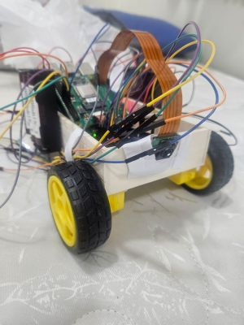

# Raspberry Pi 5 + Hailo‑8L Behavioral Cloning Car

Raspberry Pi 5 autonomous car using the Raspberry Pi AI Kit (Hailo-8L) to run a Keras NVIDIA behavioral-cloning model compiled to **.hef**. Frames are captured with Picamera2, preprocessed (crop→YUV→blur→resize), inferred in real time via HailoRT’s InferModel API, and the predicted steering angle $-1, 1$ is mapped to L298N dual-motor PWM (0–255) for skid-steer control. Includes scripts for ONNX export, Hailo compile, live inference, and motor driving.



End‑to‑end guide to run a Keras NVIDIA‑style behavioral cloning model on a Raspberry Pi 5 with the Raspberry Pi AI Kit (Hailo‑8L), stream frames from the Pi camera, and drive dual DC motors via L298N.

---

## Wiring
1. Connect Raspberry Pi 5 SPI pins to Arduino SPI pins through **SparkFun Logic Level Converter - Bi-Directional**
2. Connect Arduino GPIO pins to L298N DC module:
    ```
    EN_A -> D9
    IN_1 -> D8
    IN_2 -> D7
    IN_3 -> D5
    IN_4 -> D4
    EN_B -> D3
    ```
3. Connect Raspberry Pi 5 to Hailo 8L via the AI kit, and the Raspberry Pi Camera through the camera port
4. Connect Raspberry Pi 5 to **Geekworm Raspberry Pi 5 UPS 18650** for voltage supply.
5. Connect both Arduino Uno voltage and L298N module to **3S2P** battery layout (**18650**).

## Quickstart
1. **Clone** this repository from GitHub:
    ```bash
    git clone https://github.com/Matan-Vinkler/self-driving-robot.git
    ```
2. **Activate** the virtual environment in the Raspberry Pi (requires remote connection):
    ```bash
    source vrobot/bin/activate
    ```
3. **Ensure** all libraries and dependencies are installed (`hailo-all`, `hailofw`, `hailort`, `hailort). Also install:
    ```bash
    pip install -r requirements.txt
    ```
4. **Upload** the Arduino code in `Arduino` directory into the Arduino Uno device.
5. **Run** the main code in the Raspberry Pi (requires remote connection):
    ```bash
    python main.py
    ```
---

## Hardware

* Raspberry Pi 5 (64‑bit OS)
* Raspberry Pi AI Kit (Hailo‑8L)
* Raspberry Pi Camera (e.g., IMX500)
* Arduino Uno
* L298N dual H‑bridge + two DC motors + power supply
* Dupont wires / breadboard as needed

## Software & Versions

* **Dev machine (compile)**: Hailo Dataflow Compiler (HDF/DFC) + CLI (`hailo`) compatible with Hailo‑8L; Python 3.8–3.11 recommended.
* **Pi (runtime)**: `hailo-all` (driver + firmware + tools), **pyHailoRT** wheel that matches runtime version (import as `hailo_platform` or `hailort`, depending on the package). Use a venv on the Pi.
* **Conversion**: TensorFlow‑CPU 2.x + `tf2onnx` to export ONNX from `.h5`.

> **Version rule:** *Driver* = *HailoRT library* = *Python wheel* = `4.20.0` (exactly). Mismatches cause load errors.

---

## Compile ONNX → HEF (Optional)
1. Run the provided notebook `behavioral_cloning_model_train.ipynb`.
2. The notebook will give you 2 files: `nvidia_model.h5`, `nvidia_model.onnx`, and `calibration_set.npy`
3. Run on the dev box with HDF installed:

    ```bash
    # 1) Parse ONNX → HAR (note the layout flag)
    hailo parser onnx model/nvidia_model.onnx --hw-arch hailo8l --input-format bhwc --net-name nvidia_model --har-path nvidia_model.har

    # 2) Optimize / quantize with calibration
    hailo optimize nvidia_model.har --hw-arch hailo8l --calib-set-path calibration_set.npy --output-har-path nvidia_model_q.har

    # 3) Compile HAR → HEF
    hailo compiler nvidia_model_q.har --hw-arch hailo8l
    # → writes ./nvidia_model.hef
    ```

---

## Troubleshooting

* **Zero dimension in parser (`… 0, 24]`)**: layout mismatch. Either export ONNX as **NCHW** or add `--input-format bhwc` to `hailo parser` (shown above).
* **`CHECK failed - Driver version … different from library version …`**: driver/lib/wheel mismatch—align versions and reboot.
* **OpenCV camera `ok=False`**: use **Picamera2** or an OpenCV GStreamer pipeline (`rpicamsrc … ! appsink`).
* **Motors stall**: raise `min_pwm` or check supply/battery sag.

---

## Safety

Test on stands first. Add a big red stop (Ctrl‑C handler sets PWM to 0). Limit `cruise` while tuning.

---

## What to Improve

This robot isn’t perfect—it’s a learning project. Here are concrete next steps to make it better.

1. Better training the model
    - **Data quality & diversity:** Collect more frames across lighting, weather, speeds, road types (curves, intersections, lane widths). Balance left/straight/right so the model doesn’t overfit to “go straight.”
    - **Label hygiene:** Inspect/denoise steering labels; smooth noisy sequences; remove frames with occlusions or stuck steering values.
    - **Preprocessing parity:** Ensure calibration set and runtime use *exactly* the same pipeline (crop → RGB→YUV → blur → resize → /255). Version-control this.
    - **Augmentation:** Random brightness, shadows, slight shifts/rotations, and horizontal flips (invert sign of angle when flipping) to improve robustness.
    - **Temporal context (optional):** Train on short frame sequences (e.g., 3–5 frames) with 1D temporal conv or LSTM to reduce jitter and anticipate turns.
    - **Loss & schedules:** Try Huber (smooth L1) or angle-weighted MSE; cosine decay or OneCycle for LR; early stopping + checkpointing.
    - **Quantization-aware training (QAT):** If accuracy drops after PTQ, fine‑tune with QAT to improve Hailo (int8) performance.
    - **Validation & metrics:** Keep a hold‑out drive; track MSE, median abs error, and correlation. Replay/offline sim to detect failure modes.
    - **Telemetry:** Log angle, speed, PWM, timestamps, and video snippets for post‑run analysis.

2. Better designing the robot (mechanical & electrical)
    - **Mechanics:** Solid camera mount (fixed height/tilt), lower center of mass, proper wheel alignment, consistent tire grip. Choose wheelbase/track for stability.
    - **Power:** Isolated supplies or good decoupling for logic vs motors; add bulk + ceramic caps near L298N; use a stable 5V BEC for the Pi; fuse the battery line.
    - **Drivers/Motors:** L298N is lossy—consider TB6612FNG or a modern MOSFET H‑bridge. Add encoders for closed‑loop speed if possible.
    - **EMI & wiring:** Short, thick motor leads; twisted pairs; separate motor and camera/AI wiring; proper grounding to reduce noise into the camera/SoC.
    - **Thermals & protection:** Heatsinks/airflow; brown‑out protection; E‑stop/kill switch you can hit quickly; secure all connectors and strain‑relieve cables.
    - **Camera orientation:** Fix in software (flip/rotate) and lock physically to keep the crop consistent.

3. Better `angle_to_pwm` function (control)
    - **Smoothing:** Use cubic shaping near 0 (e.g., `a = sign(a)*|a|^3`) and low‑pass filter the command (`ema`) to cut jitter.
    - **Speed governor:** Reduce speed on sharp turns (e.g., `v = cruise*(1 - k_slow*|a|)`), cap max rate‑of‑change (slew limit).
    - **Minimum effective PWM:** Apply a `min_pwm` to overcome stiction; auto‑calibrate by slowly ramping until motion is detected.
    - **Sign & gain calibration:** Confirm left/right sign; tune steering gain `k`; clamp outputs and add dead‑band if needed.
    - **Kinematics:** If treating `angle` as steering wheel angle, map to curvature and compute differential wheel speeds (Ackermann→diff). Otherwise, stick to robust tank‑steer mapping.
    - **Safety interlocks:** Timeout to zero on lost frames; watchdog; angle/pwm sanity checks; manual override input.
    - **Logging:** Record `angle`, `left_pwm`, `right_pwm`, and speed for tuning; visualize after each run.

---
